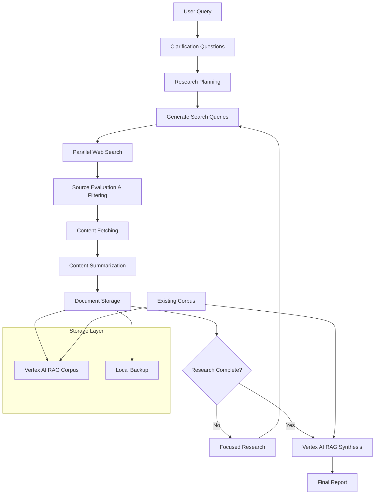

# Thunk - Deep Research Agent

A sophisticated AI-powered research assistant that autonomously performs multi-step web research and synthesizes findings into comprehensive reports using Google's Vertex AI and Gemini models.

[](https://deepwiki.com/wbeard/thunk)

## 🎯 Overview

Thunk replicates advanced research capabilities similar to Google's Gemini Deep Research, providing:

- **Autonomous Research Planning** - Breaks down complex queries into structured research steps
- **Multiple Search Providers** - Support for web search (SerpAPI) and academic papers (arXiv)
- **Intelligent Content Filtering** - AI-powered quality filtering and relevance evaluation
- **Content Analysis** - Fetches and processes web pages, PDFs, and academic papers
- **Vertex AI RAG Integration** - Stores and manages research findings using Google's RAG engine
- **Interactive CLI** - User-friendly command-line interface with clarification support
- **Report Synthesis** - Generates comprehensive reports with proper citations

## 🏗️ Architecture & Research Flow



The research flow follows these phases:

1. **Query Analysis** - Analyzes complexity and generates clarifying questions
2. **Research Planning** - Creates structured multi-step research plan
3. **Parallel Execution** - Concurrent search queries with rate limiting
4. **Quality Filtering** - AI-powered source relevance evaluation
5. **Content Processing** - Fetch, summarize, and store documents
6. **Completeness Assessment** - Determines if additional focused research is needed
7. **Synthesis** - Uses Vertex AI RAG for enhanced report generation

## 🚀 Quick Start

### Prerequisites

1. **Python 3.9+**
2. **uv** - Fast Python package manager ([install uv](https://docs.astral.sh/uv/getting-started/installation/))
3. **Google Cloud Project** with Vertex AI API enabled
4. **API Keys** for SerpAPI and Google Cloud authentication

### Installation

```bash
# Clone the repository
git clone git@github.com:wbeard/thunk.git
cd thunk

# Install dependencies with uv
uv sync

# Set up Google Cloud authentication
gcloud auth application-default login
```

### Configuration

Create a `.env` file with your API keys:

```bash
# Required for web search (not needed for arXiv-only research)
SERPAPI_KEY=your_serpapi_key_here

# Always required
GOOGLE_CLOUD_PROJECT=your_gcp_project_id

# Optional (with defaults)
VERTEX_AI_LOCATION=us-central1
RAG_CORPUS_NAME=research_corpus_6
RAG_MODEL_NAME=gemini-2.5-flash-preview-05-20
MODEL_NAME=gemini-2.5-flash-preview-05-20
```

### API Keys Setup

**SerpAPI Key (for web search):**
1. Sign up at [SerpAPI](https://serpapi.com)
2. Get your API key from the dashboard
3. Add to `.env` file as `SERPAPI_KEY`
4. **Note**: Not required if using `--search-provider arxiv` exclusively

**Google Cloud Setup:**
1. Create a Google Cloud Project
2. Enable Vertex AI API in the console
3. Set up authentication: `gcloud auth application-default login`
4. Set project ID in `.env` as `GOOGLE_CLOUD_PROJECT`

### Verify Configuration

```bash
# Check configuration
uv run thunk --check-config
```

## 🖥️ CLI Usage

The CLI provides multiple ways to interact with the research agent:

### Basic Research Query

```bash
# Simple web research query
uv run thunk "Latest developments in quantum computing 2024"

# Academic paper research using arXiv
uv run thunk "quantum computing" --search-provider arxiv

# With specific corpus and output options
uv run thunk "AI safety research trends" --corpus my_research --output report.md --full

# Quiet mode (minimal output)
uv run thunk "research query" --quiet
```

### Interactive Mode

```bash
# Start interactive session with web search
uv run thunk --interactive

# Start interactive session with arXiv search
uv run thunk --interactive --search-provider arxiv

# Available commands in interactive mode:
# <query>                     - Run research with clarification
# regenerate <query>          - Regenerate from existing corpus
# regenerate-no-rag <query>   - Regenerate without Vertex AI RAG
# corpus-info                 - Show corpus information
# quit                        - Exit interactive mode
```

### Regeneration Mode

```bash
# Regenerate report from existing corpus (uses Vertex AI RAG)
uv run thunk --regenerate "quantum computing trends"

# Regenerate without using Vertex AI RAG
uv run thunk --regenerate "AI developments" --no-rag

# Regenerate with specific corpus
uv run thunk --regenerate "research topic" --corpus specific_corpus
```

### Debug and Configuration

```bash
# Check configuration and API keys
uv run thunk --check-config

# Enable debug mode with verbose output
uv run thunk "research query" --debug

# Use specific RAG corpus
uv run thunk "query" --corpus my_research_corpus
```

### CLI Options

| Option | Short | Description |
|--------|-------|-------------|
| `--interactive` | `-i` | Run in interactive mode |
| `--query` | `-q` | Research query (alternative to positional) |
| `--regenerate` | `-r` | Regenerate from existing corpus |
| `--search-provider` | `-s` | Search provider: `web` (default) or `arxiv` |
| `--output` | `-o` | Output file for report |
| `--corpus` | `-c` | Name of Vertex AI RAG corpus to use |
| `--no-save` | | Don't save report to file |
| `--full` | | Display full report (don't truncate) |
| `--quiet` | `-k` | Minimal output mode |
| `--debug` | `-d` | Enable debug mode with verbose output |
| `--no-rag` | | Don't use Vertex AI RAG for regeneration |
| `--check-config` | | Check configuration and exit |

### Example Workflows

```bash
# First-time setup
uv run thunk --check-config

# Interactive research session with web search
uv run thunk --interactive

# Academic research session with arXiv
uv run thunk --interactive --search-provider arxiv

# Quick web research with custom corpus
uv run thunk "AI trends 2024" --corpus ai_research --debug

# Academic paper research
uv run thunk "machine learning quantum computing" --search-provider arxiv

# Regenerate previous research
uv run thunk --regenerate "previous query" --corpus ai_research
```

## ⚙️ Configuration Options

### Environment Variables

The following environment variables can be configured:

| Variable | Required | Default | Description |
|----------|----------|---------|-------------|
| `SERPAPI_KEY` | Only for web search | - | SerpAPI key for web search |
| `GOOGLE_CLOUD_PROJECT` | ✅ Yes | - | Google Cloud project ID |
| `VERTEX_AI_LOCATION` | No | `us-central1` | Vertex AI region |
| `RAG_CORPUS_NAME` | No | `research_corpus_6` | Name for RAG corpus |
| `RAG_MODEL_NAME` | No | `gemini-2.5-flash-preview-05-20` | Model for RAG synthesis |
| `MODEL_NAME` | No | `gemini-2.5-flash-preview-05-20` | Primary Gemini model |

### ResearchConfig Class

The `ResearchConfig` class automatically loads and validates configuration:

```python
from src.thunk.types import ResearchConfig

# Automatically loads from environment variables
config = ResearchConfig(corpus_display_name="my_corpus", search_provider="web")

# For arXiv-only research (no SERPAPI_KEY needed)
config_arxiv = ResearchConfig(corpus_display_name="my_corpus", search_provider="arxiv")

# Validates required configuration
try:
    config._validate_config()
    print("Configuration is valid")
except ValueError as e:
    print(f"Configuration error: {e}")
```

### Troubleshooting Configuration

**Common configuration issues:**

1. **Missing API Keys**: 
   - For web search: Ensure `SERPAPI_KEY` and `GOOGLE_CLOUD_PROJECT` are set
   - For arXiv search: Only `GOOGLE_CLOUD_PROJECT` is required
2. **Authentication**: Run `gcloud auth application-default login`
3. **Corpus Name**: Provide via `--corpus` argument or `RAG_CORPUS_NAME` environment variable

```bash
# Debug configuration issues
uv run thunk --check-config

# Check configuration for arXiv search (no SerpAPI needed)
uv run thunk --check-config --search-provider arxiv

# Example error messages:
# "Missing required configuration: SERPAPI_KEY" (for web search)
# "Missing required configuration: GOOGLE_CLOUD_PROJECT"
# "Missing required configuration: --corpus argument or RAG_CORPUS_NAME environment variable"
```

## 🔍 Search Providers

Thunk supports multiple search providers through a pluggable architecture:

### Web Search (Default)
- **Provider**: SerpAPI integration
- **Content**: Web pages, news articles, blog posts
- **Requirements**: `SERPAPI_KEY` environment variable
- **Usage**: `--search-provider web` (default)

### Academic Papers (arXiv)
- **Provider**: arXiv.org academic repository
- **Content**: Research papers, preprints, academic publications
- **Requirements**: No additional API keys needed
- **Usage**: `--search-provider arxiv`

### Example Usage Patterns

```bash
# General web research
uv run thunk "latest AI developments 2024" --search-provider web

# Academic research
uv run thunk "transformer architectures" --search-provider arxiv

# Mixed research (use different providers in separate sessions)
uv run thunk "quantum computing applications" --search-provider web --corpus quantum_web
uv run thunk "quantum computing theory" --search-provider arxiv --corpus quantum_papers
```

## 🤝 Contributing

The system is designed to be extensible:
- **Add new search providers** - Implement the `SearchProvider` interface
- **Add new content fetchers** - Support different file types
- **Implement custom RAG engines** - Beyond Vertex AI
- **Create specialized event subscribers** - For different use cases
- **Extend the CLI** - With additional features

## 📄 License

[Add your license information here]

---

*Thunk provides a powerful foundation for automated research tasks while maintaining flexibility for customization and extension.*